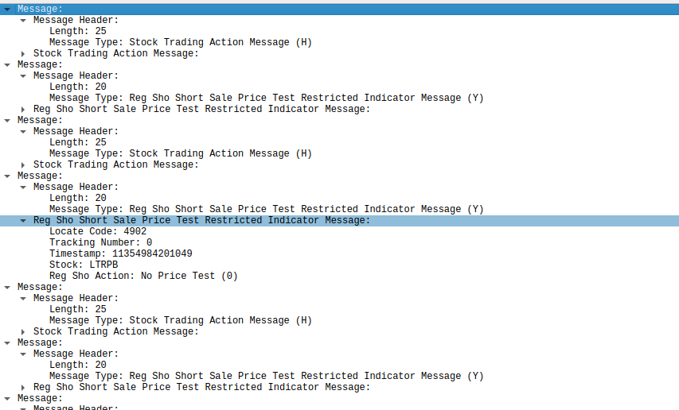

# WIP

# ITCH 5.0 simulation feed over MoldUDP64

- Server for ITCH 5.0 feed replay from ITCH data over MoldUDP64.

# Functionality

- Reads raw ITCH 5.0 messages from a binary file.
- Packs these ITCH messages into MoldUDP64 datagrams.
- Multicast feed
- Retransmission feed (todo)

# Using
## Build
- todo instructions
## Input File Format

- This tool works **only** with historical ITCH binary files from [emi.nasdaq.com](https://emi.nasdaq.com/ITCH/Nasdaq%20ITCH/).
- I'm unaware of the format of more recent dumps as they are paid so I'm just working with this as it's free.
- The input ITCH file is a sequence of records. Each record is:
    - Length Prefix (2 bytes): Unsigned 16-bit integer, BIG-ENDIAN. Specifies the length (L) of the ITCH payload that follows.
    - ITCH Payload (L bytes): The actual ITCH 5.0 message.
    - `[uint16_t BE_LEN L][PAYLOAD[L]]`
- Should work with any NASDAQ ITCH files but only tested with Nasdaq NSM
## Monitoring
- [This](https://github.com/Open-Markets-Initiative/wireshark-lua/tree/main/Nasdaq) repository provides wireshark dissectors for various ITCH protocols in wireshark and be used on this server for inspecting output.
- Example screenshot of dissected output of the multicast market feed:

 
